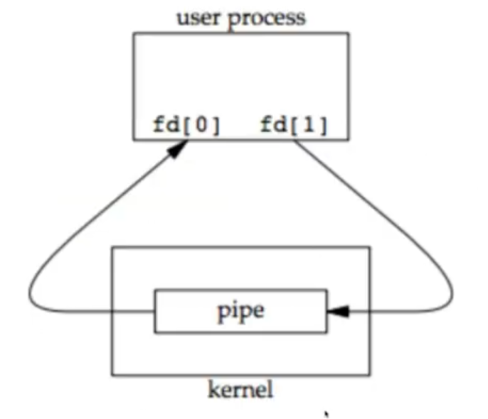
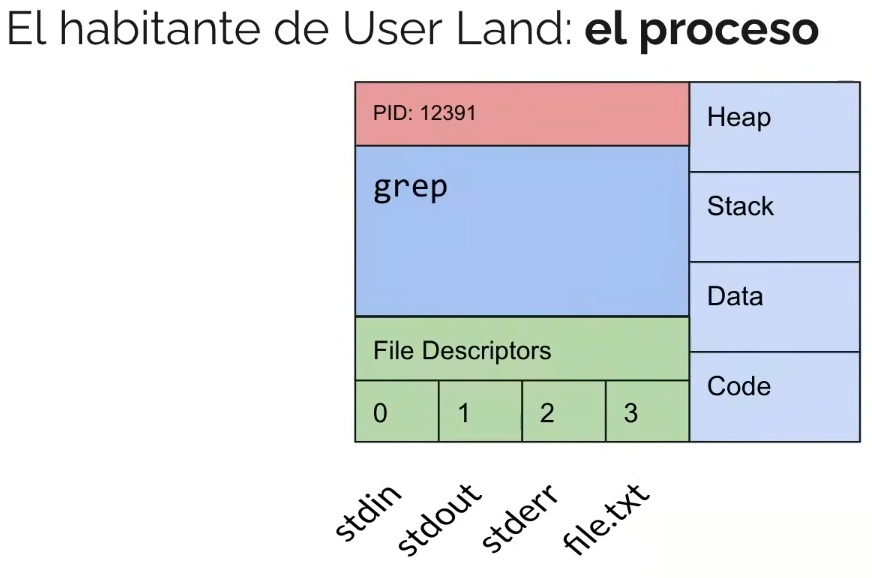
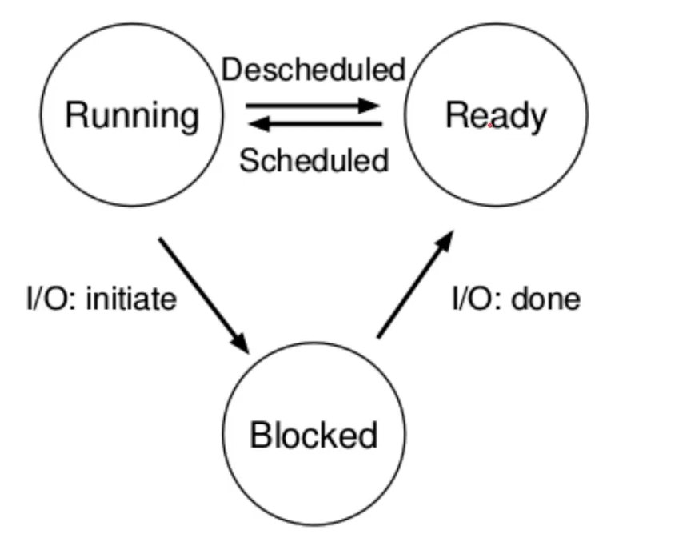

# Proceso

Es una instancia de un programa en ejecución

Cada proceso tiene un Process ID (PID) que es único, una tabla de file descriptors (fds) y memoria: code segment, data segment, stack y heap.

Cerrar un file descriptor en un proceso no lo cierra en el otro.

## Resumen de funciones de procesos

- fork(): crea un nuevo proceso identico al actual excepto por el pid, y devuelve su pid. El hijo hereda los fds del proceso padre.
- wait(): el proceso actual se queda esperando a que uno de sus hijos muera, devuelve el id del proceso hijo que murio.  
- getpid(): devuelve el id del proceso actual.   
- getppid(): devuelve el pid del padre del proceso actual
- exec(): carga y ejecuta un nuevo programa que pisa al actual, presenta muchas variantes. ver https://dashdash.io/3/exec 
- exit(): termina el proceso y devuelve un exit code al SO
- kill(pid): termina el proceso identificado por pid
- pipe(): crea un canal de comunicacion UNIDIRECCIONAL entre dos procesos, con un extremo de escritura y otro de lectura. Hay que pasarle un array de 2 enteros. el index 0 es de lectura, y el index 1 es de escritura.
  
- dup(): duplica un fd, creando una copia exacta.
- dup2(): lo mismo que dup pero mas facil de manejar porque tiene dos parametros

## Estructura de un proceso
El proceso tiene un contexto, puede pensarse como el estado completo del proceso conformado por:
- Espacio de direcciones de memoria o `address space`
- Registros del procesador
- Estructuras del kernel

### Trampoline y trapframe:
- Trampoline: codigo para guardar los registros y finalmente llama al kernel.
    - Guarda todos los registros en el traframe
    - Cambia el registro satp, cambiando la tabla de paginas y el address space
    - indica en el registro sp apuntando al kstack del proc actual
    - invoca usertrap() y salta al kernel

- Trapframe: lugar en donde se guardan los registros

## De programa a proceso
El kernel se encarga de:
1. carga instrucciones y datos 
2. crea el `Stack` y el `Heap`
3. Transfiere el control al programa
4. Protege al SO y al Programa.

## Estados de un Proceso
Se corre ***UN PROCESO*** a la vez por `CPU`.  
Hay 3 estados generales:

- Running: el proceso esta actualmente corriendo en el CPU, hasta que el kernel lo cierre por un `timer interrupt`, hasta que termine de correr, o hasta que se bloquee esperando por una respuesta de I/O.
- Blocked: esta bloqueado esperando una respuesta de I/O.
- Ready o Runnable: esta esperando a que el kernel lo elija para ser ejecutado por el CPU.

## Contexto del Proceso
`Contexto`: La informacion necesaria para describir completamente el estado de un proceso. Cada proceso tiene su propio contexto.  

El contexto esta formado por:
- El contenido del `address space` (memoria: text, data, heap y stack).
- El contenido de los registros de hardware (cpu).
- Las estructuras de datos que pertenecen al kernel relacionadas con el proceso (kernel: process table entry, configuracion de memoria, kernel stack).  

Cada proceso ve *SOLAMENTE* su contexto.  

### Process Control Block
Cada proceso esta representado en el sistema operativo por un `Process Control Block (PCB)` que contiene informacion del proceso. Se suelen llamar tambien Process Table Entry porque se guardan en una tabla.  

Entre el PCB se contiene:
- `Process ID (PID)` y `Process Group ID (PGID)`.
- Ubicacion del mapa de direcciones del kernel u area del proceso.
- Estado
- Puntero al siguiente proceso en el planificador y al anterior (es una lista enlazada)
- Prioridad
- Informacion para el manejo de señales
- Informacion para la administracion de memoria.