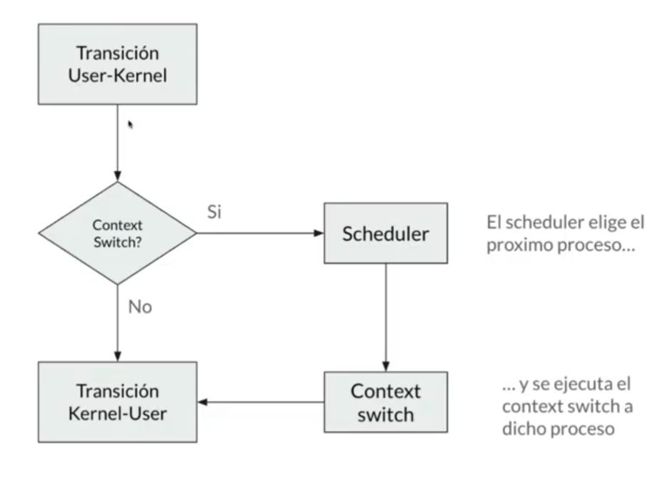
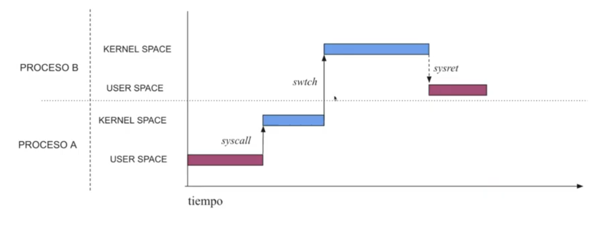
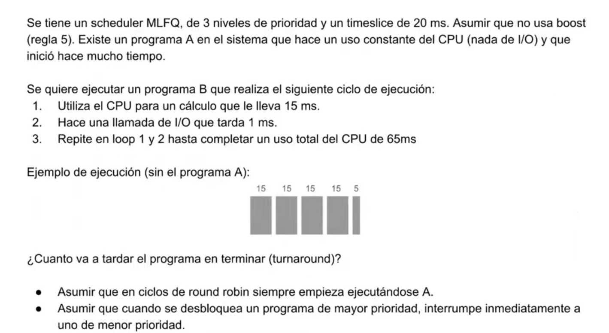
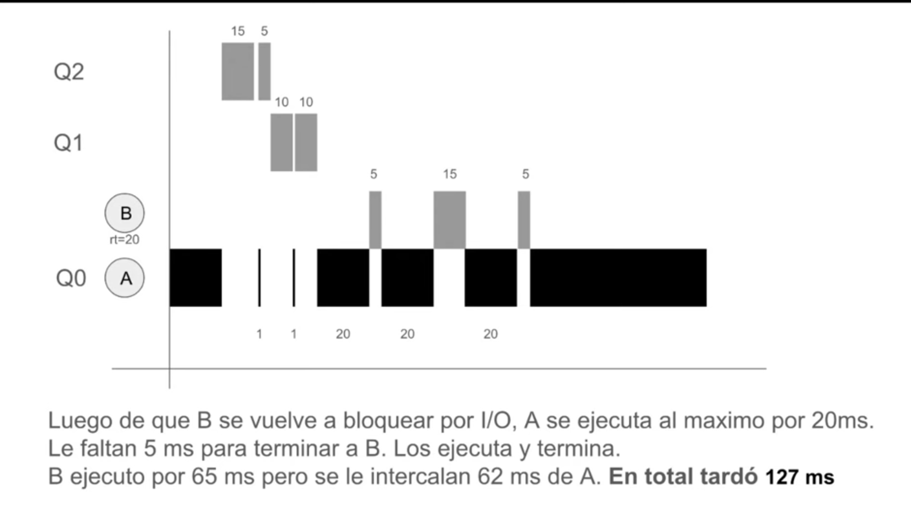
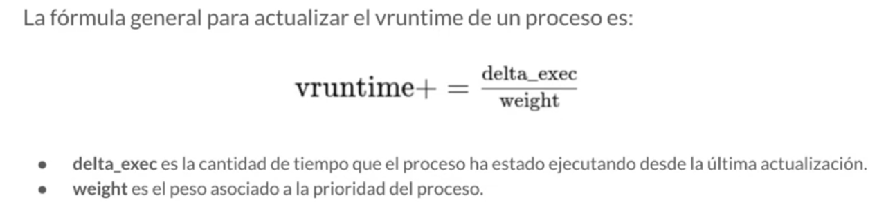

# Scheduler en xv6
### Metricas
T turnAround = T completion - T arrival  
T respuesta = T firstrun - T arrival 
## Cambio de contexto
Se da un cambio de contexto por:
- System calls 
- I/O interrupt
- Timer Interrupt
- Exception

  
----------
# Scheduling
- Preemptivo: el sistema puede interrumpir un proceso para cambiarlo por otro
- No preemptivo: el proceso se ejecuta hasta que termine (ya ni existe).

## Politicas de scheduling
### FIFO 
Se ejecutan los procesos por orden de llegada, es una cola.

### Shortest Job First (SJF)
Se ponen en la cola de primero los procesos de ejecucion corta y ultimos los mas largos, necesariamente tenemos que saber la duracion, suponerla o estimarla, para ordenarlos segun tiempo de ejecucion.
### Shortest Time-to-Completion (STCF)
Lo mismo que SJF, pero al llegar un proceso nuevo, si es mas corto que el actual, interrumpe el actual y ejecuta el nuevo. Es preemptivo a direrencia de SJF. Al igual que SJF, tiene el problema de necesitar saber cuanto dura el proceso, que es imposible.
### Round Robin
Se ejecuta cada proceso que esté en estado `runnable` de la cola durante un `time slice` o `quantum`. Tiene que ser un multiplo del `Timer Interrupt`.
### Multi-Level Feedback Queue (MLFQ)
Intenta optimizar tanto turnaround time como response time para servit para procesos batch e interactivos al mismo tiempo.  
Los procesos que requieren mucho response time (se ejecutan poco y esperan mucho) van a tener mejores prioridades, y los que requieren mucho cómputo van a tener mala prioridad.  
- Si el proc A tiene mejor prioridad que B, A se ejecuta y B no.
- Si A, B y C tienen la misma prioridad, se ejecutan en RR
- Cuando llega un proc nuevo, ingresa con alta prioridad
- Si un proc completa su time slice, independientemente de cuantas veces haya renunciado al uso del CPU, su prioridad se reduce
- Despues de cierto tiempo, se mueven todos los procs arriba para evitar la `starvation`.  

`Starvation`: Si hay muchas tareas interactivas o cortas, estaran arriba siempre, mientras que una tarea que dura mucho estara abajo y nunca mas se ejecuta.

#### Enunciado de parcial MLFQ

### Completely Fair Scheduler (CFS)
`Fairness`: el CFS busca darle a cada proceso una porcion justa del CPU. No le importa la cantidad de veces que los procesos accedieron al CPU, sino mas bien el tiempo total que lo usaron, el vruntime
`vruntime`: Tiempo de ejecucion que ya tuvo un proceso  
El algoritmo de seleccion cada vez que tiene que elegir un proceso, elige siempre el que este mas atras en vruntime consumido
#### Prioridad en CFS
"El reloj de los procs de mayor prioridad va mas lento": un proceso de alta prioridad, ocupara mas tiempo real el CPU, pero vruntime sumara una ponderacion basada en el peso de su prioridad. En terminos de tiempo real, se ejecuto mucho mas que los que tenian menos prioridad, en terminos de tiempo virtual, se habran ejecutado lo mismo.  
Eventualmente el vruntime recorta digitos para no pasarse de verga, como venezuela que le saca ceros de vez en cuando a la moneda.

#### RunQueue
Cada CPU tiene un arbol rojo-negro que tiene todos los procesos que estan en estado runnable  
Cuando un proceso se pone en estado runnable, se inserta O(log n)  
Cuando un proceso deja de estar en runnable, se elimina O(log n)  
Siempre se busca el de vruntime mas bajo, el que esta mas a la izquierda, guarda un puntero al nodo mas chico, acceso O(1)

#### Balance de carga
El CFS se encarga de equilibrar la carga de trabajo entre todos los CPUs, lo hace migrando procesos de una CPU a otra si se detecta que una esta sobrecargada respecto de otra.
#### Soporte para multi-threading
El CFS trata a los threads como procesos independientes

#### Nice
La prioridad en Linux se llama `nice`, varia entre -20 (mas favorable) y 19 (menos favorable). A los de mejor nice les va a asignar time slices mas altos.
Hay un tiempo minimo de ejecucion llamado `min_granularity`
