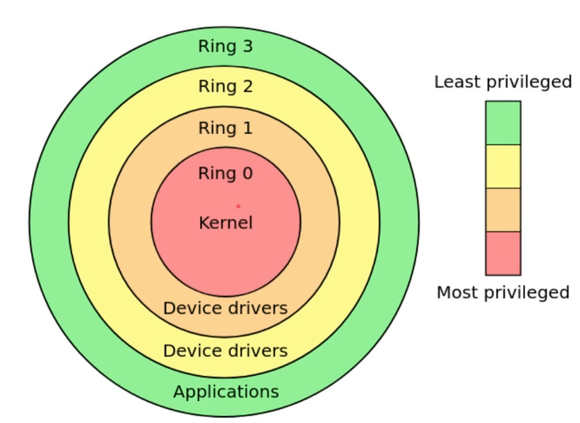

## Tipos de ejecucion
### Ejecucion Directa

> No provee aislamiento y proteccion

- Nada garantiza que un programa no modifique a otro (o al SO)
- Acceso directo al storage permanente: nada garantiza que un programa no dañe el filesystem
- Nada garantiza que un programa termine, se interrumpa, etc.

### Ejecucion Directa Limitada
El **hardware** va a limitar ciertas operaciones  
Un programa especial y privilegiado va a arbitrar las operaciones riesgosas, el `kernel`.

## Modos de ejecucion

### User Space
- Una aplicacion esta en modo usuario (ring 3).  
- No puede ejecutar instrucciones privilegiadas (de ring 0)

### Kernel space
- Solo el kernel se ejecuta en kernel-space (ring 0)
- Puede ejecutar instrucciones privilegiadas
### Rings 1 y 2
Se usaban para drivers, maquinas virtuales, para los efectos de esta materia no se usan y no son importantes.  

## System Call
Una system call es un punto de entrada controlado al kernel, un servicio que el kernel provee para que los programas de user-space le soliciten realizar alguna operacion.  
Cambia el procesador de `user mode` a `kernel mode`.  

## Timer interrupts
¿Como hace el kernel para recuperar el CPU?  

Casi todos los procesadores tienen un `Hardware Timer`, que cada timer interrumpe a un CPU mediante una interrupcion de hardware que se llama `Timer Interrupt`, y le devuelve el CPU al kernel. Esto pasa cuando un proceso usa durante mucho tiempo el CPU sin irse a dormir o ceder el CPU. El kernel va a decidir qué hace con el proceso (probablemente lo mate o lo mande a dormir), y cuál va a ser el siguiente proceso a ejecutarse.

## Transiciones de Modo
### User mode a Kernel mode
Se da por interrupciones (I/O y el timer), excepciones del procesador, o syscalls

#### Interrupciones
La interrupcion hace que se salte al kernel, este resuelve la interrupcion y le dice a la CPU que lo ejecute.  
#### Excepciones
Es un evento de hardware causado por una aplicacion de usuario que causa la transferencia del control al `Kernel`. Se suele manejar con un mecanismo similar (o igual) que las interrupciones.