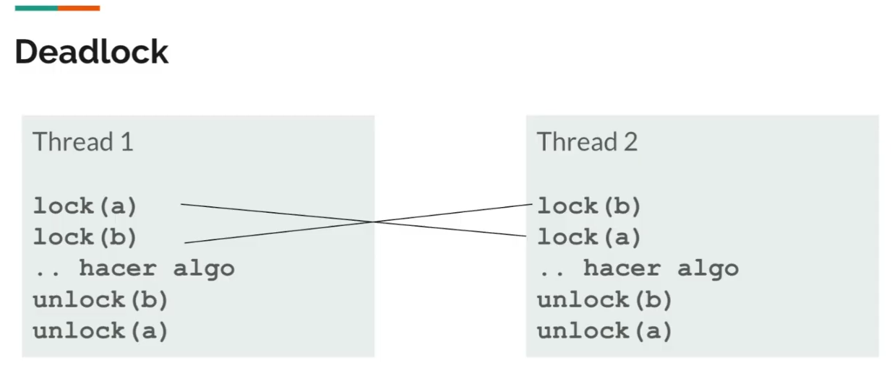

### Race condition
Si hay un recurso y varios threads tratando de modificarlo al mismo tiempo, se entrelazan los threads tratando de modificarlo a la vez.

### Seccion critica
Seccion donde puede darse una race condition, donde deberia entrar solo un thread a la vez.  

## Locks
Permite hacer una `exclusión mutua`, esto es, rodear la sección crítica, con lock() y unlock() para que solo uno entre a la vez.  
Eventualmente todos los threads van a obtener el lock, el procesador no puede darle el lock siempre al mismo thread.

### Spinlock
Se implementa usando un `busy wait`. Espera en un bucle infinito a que el lock se libere para obtenerlo.  
Se debe usar cuando:
- El tiempo que se posee el lock es corto
- Hay poca contention por los locks, lo mas probable es obtenerlo y no competir con otros threads
- Cuando hay paralelismo real (varios CPUs). Sino no habra ningun otro hilo realmente corriendo que pueda tomar el lock

### Sleeplock
Se implementa cediendo el procesador. Si no lo esta tomando nadie, lo toma. Si esta ocupado, se va a dormir esperando a que se libere. Cuando se libera el lock, eso causa que todos se despierten y vuelvan a competir por el lock.  
Se debe usar cuando:
- La espera sera larga y no queremos bloquear el acceso al CPU para otros procesos (ej cuando se espera que el disco lea bloques)
- En sistemas de un solo procesador, donde un spinlock solo seria desalojado del procesador al acabarse su timeslice  

Tiene que hacerse dentro de una region critica.  

### Deadlock
No es un lock, es un concepto. Se da un deadlock cuando dos procesos se traban mutuamente esperando que se destrabe el otro.
