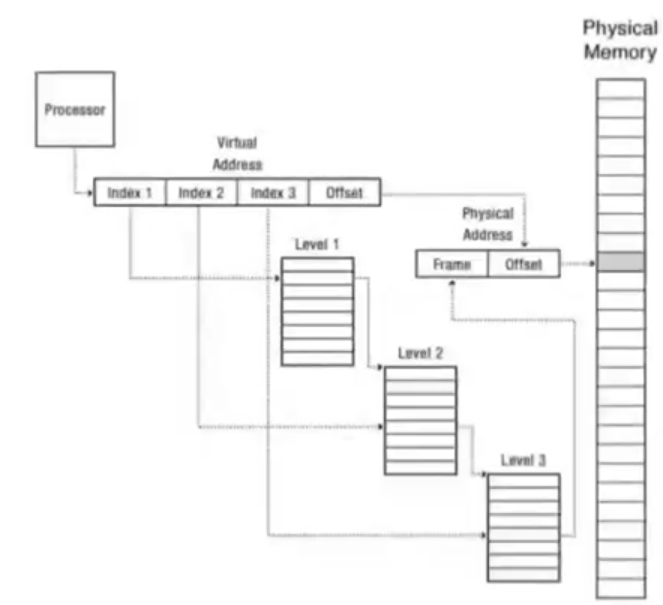

## Virtualizacion

El sistema operativo le hace creer a cada proceso que está sólo en memoria, para esto le da un stack, un heap y un address space.  
El proceso que se está ejecutando tiene que creer que está sólo.  
El proceso no debe poder acceder a la memoria de otro proceso.  

La `TLB` (Translation Lookaside Buffer) es un cache que guarda las ultimas traducciones de direcciones virtuales. En cuanto a hardware, está más cerca del procesador que la memoria, por lo que es muchisimo mas rápido conseguir la traducción de ahí.

La CPU pide direcciones virtuales a la TLB para ver si la tiene cacheada, si está, es un hit y se accede al frame físico inmediatamente con el offset indicado en la virtual address, sin tener que traducir la dirección nuevamente e ir a traer la pagina de memoria. Si no, es un miss y la MMU traduce la dirección y la va a buscar a través de las tablas.

### Base and bound (segmentacion)
Para encontrar la direccion virtual, usaba dos registros. `Base` como el principio de una region de memoria, y `virtual address` como un offset de esta region. `bound` es usado como un tope, base+bound es el tope de la region de memoria del proceso. La idea es que modificando base y bound obtenemos regiones distintas.

### Address translation con tablas de segmentos
Una virtual address ahora es mitad `segment` y mitad `offset`. El `segment` hace referencia a una entrada de la tabla, esta devuelve los `Base y Bound`, con permisos de acceso R/W.  
Cuando te pasabas del segmento del programa, se obtenia segmentation fault.  

### Memoria paginada
Dividir la memoria entera en paginas de 4Kb  
Los primeros bits msb indican una tabla, los proximos la que sigue, etc. La ultima page table va a dar el address del frame fisico, y los 12 bits lsb de la virtual address, son el offset en el frame.  

### Memoria paginada en x86
Hay un solo `Page Directory` (PD) por proceso, referenciado por el registro cr3, si modifico el cr3 para que apunte a otro lado, apuntara al PD de otro proceso.  
Cada tabla tiene 1024 entradas, que cada entrada contiene en sus 20 msb bits, la direccion de la proxima tabla que referencia, y en sus otros 12 bits, flags.  

`kalloc`: Aloca una pagina fisica. Trabaja con direcciones fisicas, no virtuales. La lista funciona como una pila.  