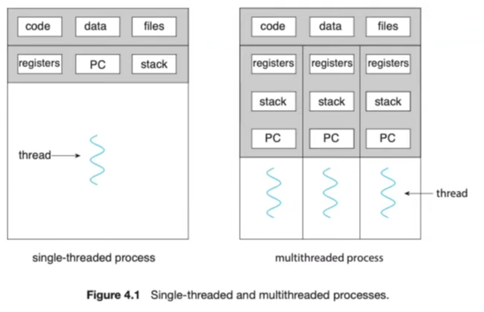
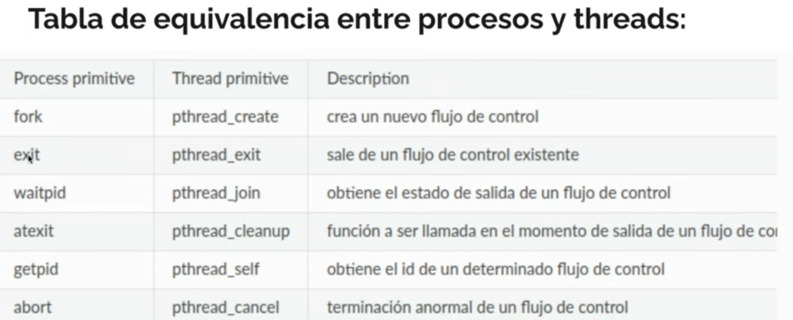
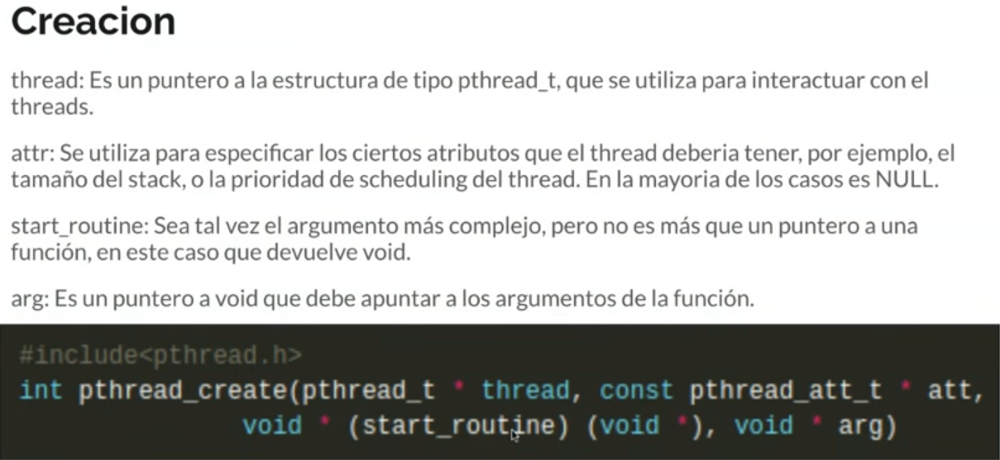
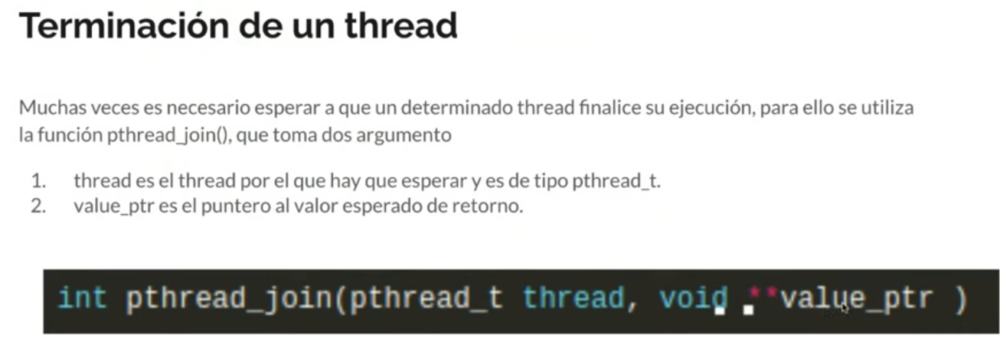

# Thread
#### Definicion
Es una secuencia de ejecucion de un proceso, un proceso puede tener muchas secuencias ejecutandose en simultaneo.  
Todos los threads del mismo proceso tienen acceso a la misma memoria virtual, al mismo codigo, variables globales y heap.

Es una cosa scheduleable
### Caracteristicas
- Thread id
- valores de registros
- stack propio
- politica y prioridad de ejecucion
- errno propio
- datos especificos del thread

## API de threads
hay que hacer #include<pthread.h>

### Creacion de thread
 
### Un thread esperando a otro: join

## Estructura
### Threads Control Block (TCB)
Es una estructura que almacena el estado del thread
- Puntero al stack del thread
- Una copia de sus registros en la cpu
Por cada thread se debe guardar esta informacion:
- ID
- Prioridad de scheduling
- Status

## Diferencias de Thread contra Proceso

- Comparten memoria
- Comparten file descriptors
- Comparten contexto del filesystem
- Comparten el manejo de señales

### Creacion de procesos y threads en linux
#### Creacion de un thread
clone(CLONE_VM | CLONE_FS | CLONE_FILES | CLONE_SIGHAND, 0);

#### Creacion de un proceso ( lo que hace fork() por detras) 
clone(SIGCHLD, 0);

#### vfork()
Es una version mas optima de fork, que en lugar de copiar todo el estado del padre, comparte la memoria del hijo con la del padre con Copy On Write (COW) cuando se modifique algo de la memoria en el hijo, 
clone(CLONE_VFORK | CLONE_VM | SIGCHLD, 0);  
